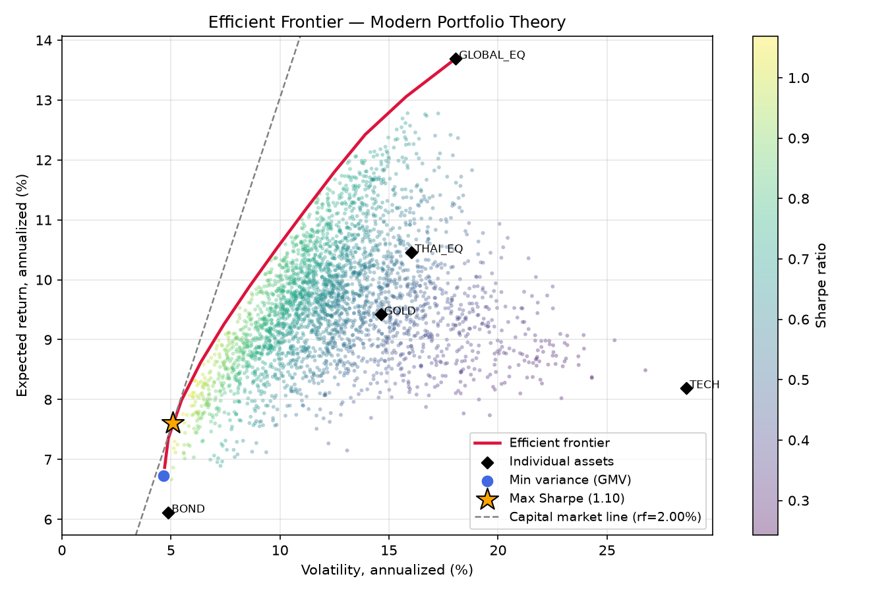

# การจัดการพอร์ตแบบ Modern Portfolio Theory (MPT)

เครื่องมือ CLI สำหรับวิเคราะห์และจัดพอร์ตลงทุนตามทฤษฎี Modern Portfolio Theory
ของ Harry Markowitz (mean–variance optimization) — ใช้ข้อมูลราคาย้อนหลังของสินทรัพย์
มาคำนวณสัดส่วนการลงทุนที่ "ดีที่สุด" ตามเป้าหมายที่เลือก พร้อมคำนวณรายการซื้อ/ขาย
เพื่อปรับพอร์ตจริงให้ตรงเป้า (rebalance)



## แนวคิดหลักของ MPT (ฉบับย่อ)

- **อย่าดูสินทรัพย์ทีละตัว ให้ดูทั้งพอร์ต** — ความเสี่ยงของพอร์ตไม่ใช่ค่าเฉลี่ย
  ความเสี่ยงรายตัว แต่ขึ้นกับ **correlation** ระหว่างกัน สินทรัพย์ที่ขึ้นลงไม่พร้อมกัน
  ช่วยหักล้างกันเอง ทำให้ความเสี่ยงรวมต่ำกว่าถือตัวเดียว (diversification)
- **Efficient frontier** — ในบรรดาพอร์ตทุกแบบที่เป็นไปได้ จะมีเส้นขอบของพอร์ตที่
  "ให้ผลตอบแทนสูงสุด ณ ความเสี่ยงนั้น ๆ" พอร์ตที่อยู่ใต้เส้นนี้คือพอร์ตที่ยังปรับปรุงได้
- **Sharpe ratio** = (ผลตอบแทนคาดหวัง − อัตราปลอดความเสี่ยง) ÷ ความผันผวน
  ใช้วัดความคุ้มค่าของผลตอบแทนต่อความเสี่ยง 1 หน่วย พอร์ตที่ Sharpe สูงสุด
  (tangency portfolio) คือจุดที่เส้น Capital Market Line สัมผัสกับ frontier

## การติดตั้ง

ต้องมี Python 3.8+ แล้วติดตั้งไลบรารี:

```bash
pip install -r requirements.txt
```

(`numpy` + `scipy` จำเป็น ส่วน `matplotlib` ใช้เฉพาะตอนวาดกราฟ `frontier --plot`)

## รูปแบบไฟล์ข้อมูล

**ไฟล์ราคา (จำเป็น)** — CSV คอลัมน์แรกเป็นวันที่ (มีหรือไม่มีก็ได้)
ตามด้วยราคาปิดของแต่ละสินทรัพย์ 1 คอลัมน์ เรียงจากเก่าไปใหม่:

```csv
date,THAI_EQ,GLOBAL_EQ,TECH,BOND,GOLD
2023-08-01,10.0000,100.0000,250.0000,12.0000,30.0000
2023-08-02,10.0477,101.5873,254.5014,12.0338,29.8149
```

ความถี่ข้อมูล (รายวัน/รายสัปดาห์/รายเดือน) ตรวจจับอัตโนมัติจากวันที่
หรือกำหนดเองด้วย `--ppy 252|52|12` ถ้าข้อมูลมีช่องว่าง เติมราคาเดิมด้วย `--ffill`

**ไฟล์พอร์ตปัจจุบัน (ใช้กับ `rebalance`)** — ระบุเป็นจำนวนหน่วย (`units`)
หรือมูลค่า (`value`) อย่างใดอย่างหนึ่ง:

```csv
asset,units
THAI_EQ,12000
GLOBAL_EQ,1500
BOND,5000
GOLD,800
```

**ไฟล์น้ำหนักเป้าหมาย (ทางเลือก)** — `asset,weight` ได้จาก `optimize --save-weights`
หรือเขียนเองก็ได้ (0.25 หรือ 25 ก็เข้าใจ)

## คำสั่งทั้ง 4

### 1) `analyze` — สำรวจสินทรัพย์ก่อนจัดพอร์ต

```bash
python mpt.py analyze sample_prices.csv
```

แสดงผลตอบแทนต่อปี, CAGR, ความผันผวน, Sharpe, Max Drawdown รายตัว
และ correlation matrix (คู่ที่ correlation ต่ำ/ติดลบ = กระจายความเสี่ยงได้ดี)

### 2) `optimize` — หาสัดส่วนการลงทุนที่เหมาะสม

```bash
# พอร์ต Sharpe สูงสุด (ค่าเริ่มต้น)
python mpt.py optimize sample_prices.csv

# พอร์ตความเสี่ยงต่ำสุด
python mpt.py optimize sample_prices.csv --objective min-vol

# เสี่ยงต่ำสุดโดยขอผลตอบแทนคาดหวัง 10% ต่อปี และห้ามถือตัวใดเกิน 35%
python mpt.py optimize sample_prices.csv --objective target-return --target 0.10 --max-weight 0.35

# บันทึกน้ำหนักไว้ใช้กับ rebalance
python mpt.py optimize sample_prices.csv --save-weights target_weights.csv
```

ตัวอย่างผลลัพธ์:

```
== Maximum Sharpe ratio portfolio (tangency) ==
Asset      Weight
---------  ------
BOND       73.60%
GLOBAL_EQ  13.75%
GOLD        9.69%
THAI_EQ     2.95%

Expected return (ann.) : 7.60%
Volatility     (ann.) : 5.08%
Sharpe ratio (rf=2.00%): 1.104
```

### 3) `frontier` — วาดเส้น efficient frontier

```bash
python mpt.py frontier sample_prices.csv --points 30 --out frontier.csv --plot frontier.png
```

ได้ตารางจุดบนเส้น frontier (ผลตอบแทน/ความเสี่ยง/Sharpe + น้ำหนักทุกจุด)
และกราฟแบบรูปด้านบน: จุดสุ่ม 3,000 พอร์ต (สีตาม Sharpe), เส้น frontier,
จุด GMV, ดาว Max Sharpe และเส้น Capital Market Line

### 4) `rebalance` — แผนซื้อ/ขายปรับพอร์ตจริง

```bash
# ปรับพอร์ตปัจจุบันเข้าหาพอร์ต max-sharpe พร้อมเติมเงิน 100,000
# และไม่แสดงรายการซื้อขายที่เล็กกว่า 500
python mpt.py rebalance sample_prices.csv --holdings sample_holdings.csv \
    --cash 100000 --min-trade 500

# หรือใช้น้ำหนักเป้าหมายจากไฟล์ที่บันทึกไว้
python mpt.py rebalance sample_prices.csv --holdings sample_holdings.csv \
    --weights target_weights.csv
```

แสดงมูลค่าปัจจุบัน → เป้าหมาย รายตัว, ยอดซื้อ/ขาย (ทั้งมูลค่าและจำนวนหน่วย)
และเปรียบเทียบสถิติพอร์ต **ก่อน/หลัง** ปรับ (ผลตอบแทนคาดหวัง, ความเสี่ยง, Sharpe)
จำนวนหน่วยเป็นทศนิยม — ปัดเข้า board lot ของโบรกเกอร์เอง (หุ้นไทยล็อตละ 100)

## ออปชันที่ใช้บ่อย

| ออปชัน | ใช้กับ | ความหมาย |
|---|---|---|
| `--rf 0.02` | ทุกคำสั่ง | อัตราปลอดความเสี่ยงต่อปี (พิมพ์ `2` = 2% ก็ได้) ค่าเริ่มต้น 2% |
| `--ppy N` | ทุกคำสั่ง | จำนวนงวดต่อปี (252 รายวัน / 52 รายสัปดาห์ / 12 รายเดือน) ปกติตรวจอัตโนมัติ |
| `--ffill` | ทุกคำสั่ง | เติมราคาก่อนหน้าแทนช่องที่ขาด |
| `--max-weight 0.35` | optimize/frontier/rebalance | เพดานน้ำหนักต่อสินทรัพย์ (กันพอร์ตกระจุก) |
| `--min-weight 0.05` | optimize/frontier/rebalance | น้ำหนักขั้นต่ำต่อสินทรัพย์ |
| `--allow-short` | optimize/frontier/rebalance | อนุญาตให้ short (น้ำหนักติดลบได้) |
| `--target 0.10` | objective `target-return` | ผลตอบแทนเป้าหมายต่อปี |
| `--cash 100000` | rebalance | เงินเติมเข้า (ติดลบ = ถอนออก) |
| `--min-trade 500` | rebalance | ข้ามรายการซื้อขายที่มูลค่าต่ำกว่านี้ |
| `--lot 100` | rebalance | ปัดจำนวนหุ้นซื้อ/ขายเป็นทวีคูณของ board lot (หุ้นไทย = 100) |

## ดึงราคาจริงจาก Yahoo Finance

`fetch_yahoo.py` (ใช้แค่ Python stdlib) ดึงราคาปิดปรับปันผลย้อนหลังมาเป็น CSV
พร้อมใช้กับ `mpt.py` ทันที — หุ้นไทยใช้ ticker ต่อท้าย `.BK`:

```bash
python fetch_yahoo.py SPALI.BK DCC.BK LHHOTEL.BK --out prices.csv
# หรือดึงตามรายชื่อในไฟล์พอร์ต
python fetch_yahoo.py --holdings my-port/holdings.csv --suffix .BK --out my-port/prices.csv
```

(ต้องรันบนเครื่องที่ออกอินเทอร์เน็ตถึง Yahoo ได้ — sandbox ของ Claude Code
บนเว็บมักบล็อก จึงเตรียมสคริปต์นี้ไว้ให้รันฝั่งผู้ใช้)

## ข้อมูลตัวอย่าง

`sample_prices.csv` (ราคารายวันจำลอง 5 สินทรัพย์ ~3 ปี) และ `sample_holdings.csv`
สร้างจาก `make_sample_data.py` แบบ deterministic (seed คงที่ รันซ้ำได้ไฟล์เดิม)
ใช้ลองคำสั่งได้ทันที เมื่อใช้งานจริงให้แทนที่ด้วยราคาสินทรัพย์ของคุณเอง
(export จากโบรกเกอร์ / SETSMART / ฐานข้อมูลกองทุน ฯลฯ)

## วิธีคำนวณ (สรุป)

- ผลตอบแทนรายงวดแบบ simple return แล้ว annualize เชิงเลขคณิต:
  `μ = mean × ppy`, `Σ = cov × ppy`
- Optimizer ใช้ SLSQP (scipy) ภายใต้เงื่อนไข น้ำหนักรวม = 1 และกรอบ
  `--min-weight/--max-weight` ผลลัพธ์ตรวจสอบแล้วตรงกับสูตรปิดของ Markowitz
  (กรณีอนุญาต short) ภายในระดับ 1e-7
- เส้น frontier = พอร์ตความเสี่ยงต่ำสุด ณ ผลตอบแทนเป้าหมายแต่ละระดับ
  ไล่จากพอร์ต GMV ถึงพอร์ตผลตอบแทนสูงสุด

## ข้อควรระวัง

- ทุกตัวเลขประเมินจาก **ข้อมูลอดีต** — ผลตอบแทนคาดหวังและ correlation
  ในอนาคตอาจต่างไปมาก (estimation error คือจุดอ่อนหลักของ MPT ในทางปฏิบัติ)
- พอร์ต optimal มักไวต่อข้อมูลนำเข้า แนะนำใช้ `--max-weight` คุมการกระจุกตัว
  และ rebalance เป็นรอบ ๆ แทนการไล่ตาม optimum ทุกวัน
- เครื่องมือนี้ไม่คิดค่าธรรมเนียม/ภาษี/สภาพคล่อง และ **ไม่ใช่คำแนะนำการลงทุน**
