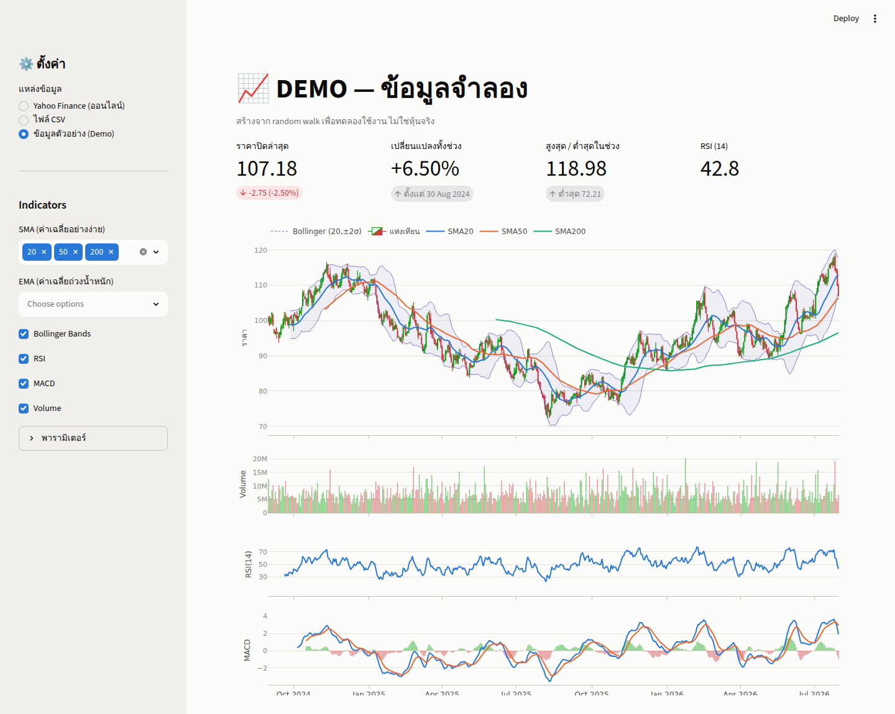

# 📈 Stock Technical Viewer

โปรแกรมแสดงกราฟเทคนิค (technical analysis) ของราคาหุ้น เป็นเว็บแอปที่รันบนเครื่องตัวเอง



## ความสามารถ

- **กราฟแท่งเทียน (Candlestick)** — แท่งขาขึ้นเป็นแท่งกลวงสีเขียว ขาลงเป็นแท่งทึบสีแดง ซูม/เลื่อนดูได้ พร้อม tooltip แสดงค่าเมื่อชี้เมาส์
- **Indicators** ครบชุดหลัก ปรับพารามิเตอร์ได้:
  - SMA (เลือกได้สูงสุด 3 เส้น เช่น 20 / 50 / 200)
  - EMA (เลือกได้สูงสุด 2 เส้น)
  - Bollinger Bands
  - RSI (พร้อมเส้น Overbought 70 / Oversold 30)
  - MACD (เส้น MACD, Signal และ Histogram)
  - Volume (แยกสีตามวันขึ้น/ลง)
- **สรุปสัญญาณอัตโนมัติ** — ราคาเทียบเส้นค่าเฉลี่ย, Golden/Death Cross, RSI Overbought/Oversold, MACD ตัดขึ้น/ลง, Bollinger %B
- **ดาวน์โหลดข้อมูล** เป็น CSV พร้อมค่า indicator ทุกคอลัมน์
- **แหล่งข้อมูล 3 แบบ**:
  1. **Yahoo Finance** — หุ้นไทย (`.BK`), หุ้นต่างประเทศ, ETF, คริปโต
  2. **ไฟล์ CSV** — ใช้ข้อมูลของตัวเองแบบออฟไลน์
  3. **ข้อมูลตัวอย่าง (Demo)** — ทดลองใช้งานได้ทันทีโดยไม่ต้องต่อเน็ต

## วิธีติดตั้ง

ต้องมี Python 3.10 ขึ้นไป ([ดาวน์โหลด](https://www.python.org/downloads/))

```bash
cd stock-technical
pip install -r requirements.txt
```

## วิธีใช้งาน

```bash
streamlit run app.py
```

เบราว์เซอร์จะเปิดหน้าโปรแกรมอัตโนมัติ (ปกติที่ http://localhost:8501)
จากนั้นเลือกแหล่งข้อมูลและกรอกสัญลักษณ์หุ้นในแถบด้านซ้าย

### ตัวอย่างสัญลักษณ์หุ้น (Yahoo Finance)

| ประเภท | ตัวอย่าง |
|---|---|
| หุ้นไทย (ต่อท้าย `.BK`) | `PTT.BK`, `KBANK.BK`, `CPALL.BK`, `AOT.BK`, `DELTA.BK` |
| หุ้นสหรัฐ | `AAPL`, `MSFT`, `NVDA`, `GOOGL` |
| ETF | `SPY`, `QQQ` |
| คริปโต | `BTC-USD`, `ETH-USD` |

### รูปแบบไฟล์ CSV

ต้องมีคอลัมน์ `Date, Open, High, Low, Close` (มี `Volume` ด้วยหรือไม่ก็ได้ ชื่อคอลัมน์ไม่สนตัวพิมพ์เล็ก-ใหญ่):

```csv
Date,Open,High,Low,Close,Volume
2026-01-05,35.25,35.75,35.00,35.50,12034500
2026-01-06,35.50,36.00,35.25,35.75,9870200
```

## โครงสร้างโค้ด

| ไฟล์ | หน้าที่ |
|---|---|
| `app.py` | หน้าจอโปรแกรม (Streamlit) |
| `charts.py` | วาดกราฟ Plotly ทุกแผง |
| `indicators.py` | คำนวณ SMA / EMA / Bollinger / RSI / MACD และสรุปสัญญาณ |
| `data_sources.py` | ดึงข้อมูล Yahoo Finance / อ่าน CSV / สร้างข้อมูลตัวอย่าง |

> ⚠️ เครื่องมือนี้จัดทำเพื่อการศึกษาเท่านั้น ไม่ใช่คำแนะนำในการลงทุน
